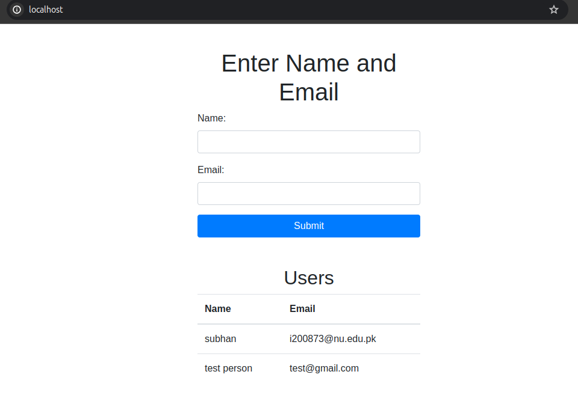

# MLOPS-Task-5
# Muhammad Subhan
# 20I-0873
# Task Overview

## Introduction
This repository contains the source code for MLOPS Task 5 DS-N

## Installation
Follow these steps to set up the project locally:

1. Clone the repository:
    ```bash
    git clone https://github.com/msubhanahmed/MLOPS-Task-5.git
    ```

2. Run the project
   ```
   sudo docker-compose up --build
   ```
---


